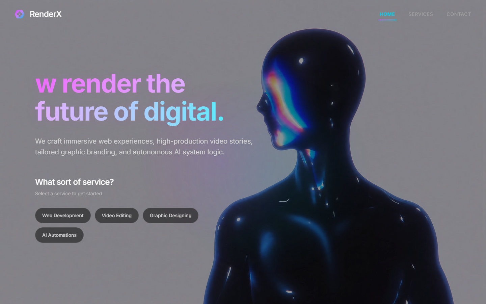

# RenderX — Premium Creative Agency

**[Live demo →](https://aayansheraz.github.io/renderx/)**



A landing site for a creative/design agency concept: a background-video hero with a gradient typewriter headline, a services showcase, per-service detail pages, and a contact page.

Built with **React 19 + TypeScript + Vite + Tailwind CSS v4 + Framer Motion (via `motion/react`) + React Router**.

## Highlights

- Full-screen video hero with an animated gradient typewriter headline
- Service picker that routes to animated detail pages — web development, video editing, graphic design, AI automations
- Route-level page transitions powered by Motion
- 100% static output — deploys to any static host

## Run locally

```bash
npm install
npm run dev      # http://localhost:5173
```

## Build for hosting

```bash
npm run build
```

Upload the contents of `dist/` to any static host (Vercel, Netlify, GitHub Pages, or shared hosting).

## Structure

```
src/
├── App.tsx                       # routes + page transitions
├── components/
│   ├── Navbar.tsx
│   ├── BackgroundVideo.tsx
│   ├── HeroPage.tsx
│   ├── ServicesPage.tsx
│   ├── ServiceSelector.tsx
│   ├── SpecificServicePage.tsx
│   ├── ContactPage.tsx
│   ├── ProjectCard.tsx
│   └── Logo.tsx
└── hooks/useTypewriter.ts
```

## Customising

- **Services & copy** → the components under `src/components/`.
- **Brand colors / theme** → Tailwind config and CSS variables in `src/index.css`.
