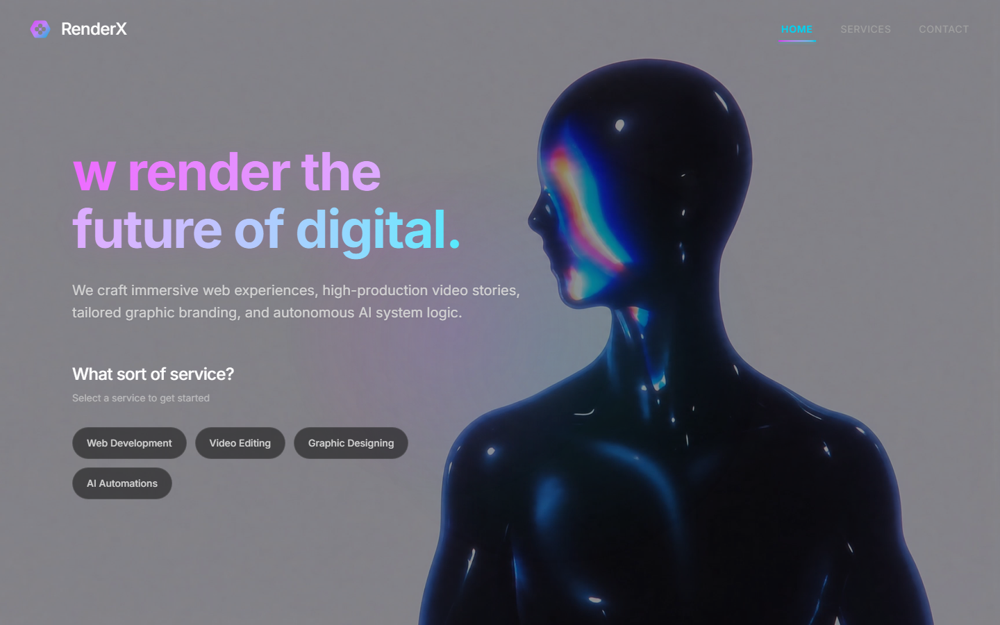

# RenderX — Premium Creative Agency Website

[](https://github.com/aayansheraz/renderx/actions/workflows/ci.yml)
[](https://aayansheraz.github.io/renderx/)
[](https://react.dev/)
[](https://tailwindcss.com/)

**[🚀 View Live Production Site →](https://aayansheraz.github.io/renderx/)**



RenderX is a high-converting, single-page web application engineered for a modern creative design agency. It features a full-screen background video hero with a gradient typewriter headline, an interactive service picker with pre-filled WhatsApp inquiry routing, an infinite brand logo marquee, and scroll-triggered animations powered by Framer Motion.

Built with **React 19 + TypeScript + Vite + Tailwind CSS v4 + Motion (`motion/react`)**.

---

## 🌟 Key Features & Architectural Highlights

- **Video Hero & Gradient Typewriter:** Full-screen background video rendering with custom CSS gradient masking and a typewriter effect.
- **Service Selector & Direct Conversion Flow:** Interactive service selector that dynamically formats and routes inquiry payloads to WhatsApp / Web3Forms.
- **Infinite Brand Logo Marquee:** 60fps CSS GPU-accelerated marquee with hover pause interaction.
- **Scroll-Spy Navigation:** Active section detection with smooth-scroll positioning.
- **Automated CI/CD:** Continuous Integration GitHub Action workflow for zero-downtime static builds.

---

## 🛠️ Project Architecture

```
src/
├── App.tsx                       # Root layout & state provider
├── components/
│   ├── Navbar.tsx                # Active scroll-spy navigation header
│   ├── BackgroundVideo.tsx       # Video layer with fallback gradient overlay
│   ├── HeroPage.tsx              # Primary landing hero section
│   ├── ServiceSelector.tsx       # Service picker -> WhatsApp payload router
│   ├── ServicesPage.tsx          # Service offerings grid
│   ├── BrandsMarquee.tsx         # GPU-accelerated client logo strip
│   ├── WhyChooseUs.tsx           # Value proposition section
│   ├── ContactPage.tsx           # Web3Forms contact form integration
│   ├── Footer.tsx                # Site footer & copyright
│   └── Logo.tsx                  # Vector brand mark
└── hooks/
    └── useTypewriter.ts          # Custom hook for typewriter text timing
```

---

## 💻 Local Development Setup

```bash
# Clone the repository
git clone https://github.com/aayansheraz/renderx.git

# Install dependencies
npm install

# Start local development server
npm run dev
```

---

## 📦 Production Build

```bash
npm run build
```

---

## 📄 License

This project is licensed under the MIT License - see the [LICENSE](LICENSE) file for details.
